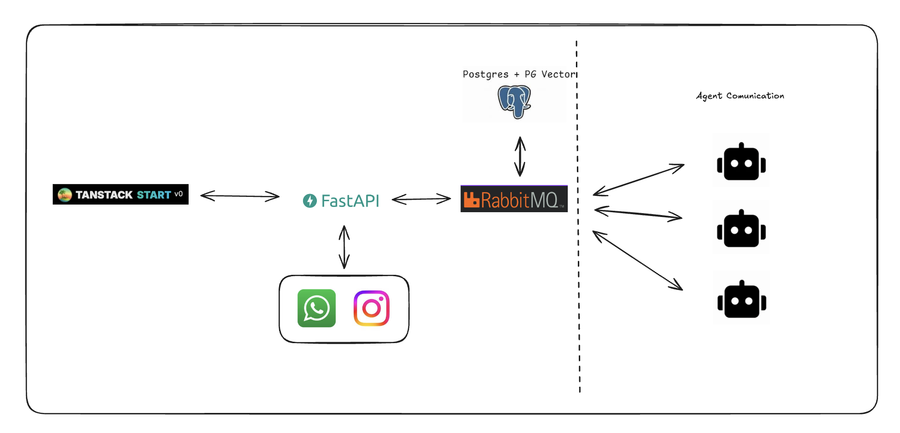
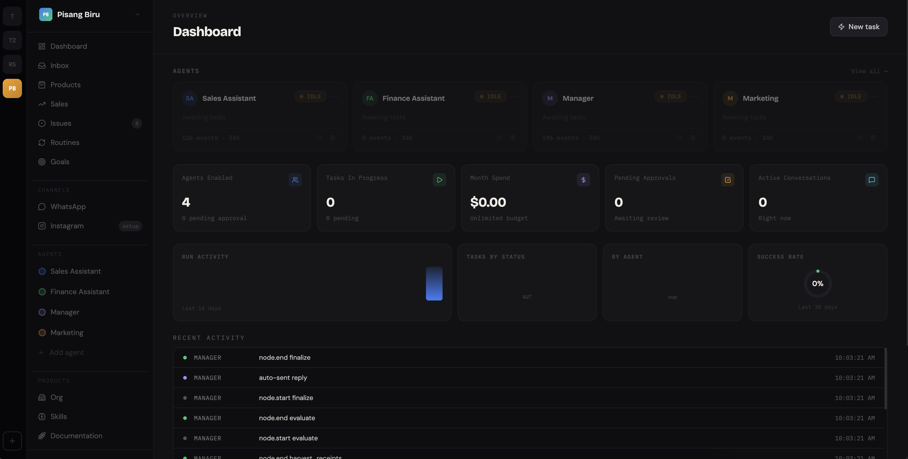
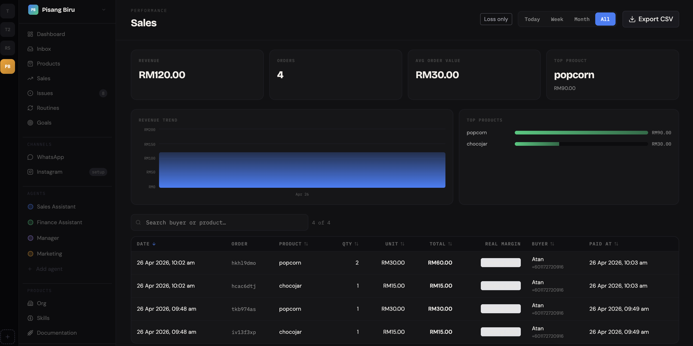

<div align="center">

# Pisang Biru — UMHackathon2026 - MicroBeezz

**Agentic commerce assistant for Malaysian microbusiness.**

A multi-agent system that runs the seller's storefront across WhatsApp and Instagram — answering customers, reserving stock, generating payment links, posting marketing creatives, tracking goals and margins — autonomously, with human escalation when confidence is low.

</div>


---

## Links

- Submission Docs - https://drive.google.com/drive/folders/197fczmj3NKyWsrmKrzwh63-hyhJHXCYb?usp=sharing

- Pitching Video - https://youtu.be/mBpTMYI8uKw


## The problem

Over 70% of Malaysian SMEs sell through WhatsApp and Instagram DMs. A solo seller hits a scale wall around 100 chats a day: orders get missed, stock drifts out of sync, and margins disappear into untracked discounts. Existing chatbots reply, but they don't *transact* — they don't reserve stock, generate payments, post promos, or know when to step aside for a human.

## The solution

- **Multi-agent, not single-prompt.** A Manager agent reviews every specialist draft (Sales, Marketing, Finance) against grounding gates and rewrites until it passes — or escalates to a human inbox.
- **Grounded by construction.** Every reply cites fact IDs from the business's own data. Hallucinated prices, stock, or order details are rejected at the gate, not after.
- **End-to-end commerce.** A single chat turn can answer the buyer, reserve inventory, mint a payment URL, and queue a finance follow-up. Marketing posts to Instagram on the seller's command.

## Architecture



TanStack Start frontend talks to a FastAPI backend. WhatsApp and Instagram bridges feed messages into the same API. RabbitMQ brokers asynchronous work to a Celery worker pool, where the LangGraph multi-agent system runs against Postgres + pgvector for long-term memory. The dashed boundary on the right is the agent runtime — manager, sales, marketing, finance — communicating through a shared state graph.

## Screenshots



*Live agent dashboard — every active agent, pending approvals, success rate, and a real-time activity feed of node-level events from the manager graph.*



*Sales page — revenue, orders, AOV, top products, and per-transaction real-margin against the buyer's chat history. Exportable to CSV.*

## Tech stack

FastAPI · LangGraph · Celery · RabbitMQ · Postgres + pgvector · BAAI/bge-m3 · TanStack Start · Prisma · Better Auth · tRPC · Docker Compose

## Quickstart

Prerequisites: Docker Desktop, Node 20+, `pnpm`, and an OpenAI-compatible LLM (set `MODEL`, `API_KEY`, `OPENAI_API_BASE` in `agents/.env`).

```bash
git clone https://github.com/Pisang-Biru/UMHackathon2026.git
cd umhackathon2026

# backend: Postgres + pgvector, RabbitMQ, FastAPI, Celery worker + beat
./scripts/dev.sh up

# frontend (separate terminal)
cd app && pnpm install && pnpm dev

# WhatsApp bridge (separate terminal, optional)
cd whatsapp && npm install && npm run dev
```

First run takes ~5 minutes: it builds the agents image, downloads `BAAI/bge-m3` (~2 GB), runs Prisma + Alembic migrations, and seeds a demo business.

| Service | URL |
|---|---|
| Frontend | http://localhost:3000 |
| Agents API | http://localhost:8000 |
| RabbitMQ admin | http://localhost:15672 (`guest` / `guest`) |
| Postgres | `localhost:5433` |

Smoke test:

```bash
curl -s -X POST http://localhost:8000/agent/support/chat \
  -H 'Content-Type: application/json' \
  -d '{
    "business_id": "dev-biz",
    "customer_id": "c1",
    "customer_phone": "+60123456789",
    "message": "nak beli 2 pisang hijau"
  }' | jq
```

Daily commands live in `./scripts/dev.sh` — `up`, `down`, `logs`, `psql`, `shell`, `seed`, `reset`.

<details>
<summary><strong>Repository structure</strong></summary>

```
agents/                   Python backend (FastAPI + LangGraph + Celery)
  app/
    agents/               manager, customer_support, marketing, finance
    memory/               pgvector embedder, repo, chunker, formatter
    routers/              /agent/*, /memory/*
    worker/               Celery app + tasks
    schemas/              Pydantic structured-reply contracts
  alembic/                migrations for the agents.* schema
  tests/                  pytest suite (47 tests)
  Dockerfile              multi-role image (api/worker/beat/init)

app/                      TypeScript frontend (TanStack Start + Prisma + tRPC)
  prisma/                 schema + migrations for the public.* schema
  src/routes/             dashboard, sales, goals, inbox, products, agents, whatsapp

whatsapp/                 Node service bridging WhatsApp Web ↔ agents API

docs/superpowers/         design specs and implementation plans
scripts/dev.sh            docker compose lifecycle wrapper
docker-compose.yml        full dev stack
```

</details>
